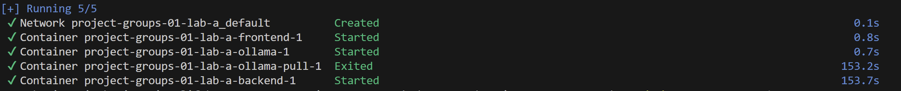
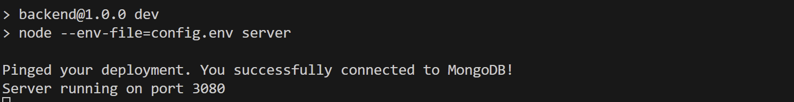

# CodeLlamaAcademy
Team Members: Emma Park, Hejia Qiu, Jeffrey Zha, Yining Zhong  

# Project Description
CodeLlamaAcademy is a simple web application that allows users to test their code interpretation skill.  

This application will have multiple frontend elements and backend elements that communicate with each other. 
The application frontend provides a sign-up page for users to create an account. 
The backend will handle the sign-up and store users’ information like username and password. 
Upon creating an account users can then login in and the backend will handle the authentication. 
After successfully logging into the application, the user will see a menu page, and they can navigate to either start a new set of code comprehension exercises or view their history data by clicking on the corresponding button. 
If the user chooses to start a new set of exercises, the application will display a simple function and prompt the user for a response. 
The response would then be reformatted to be used in an API call to Ollama from the backend. 
Ollama will proceed to use a LLM to generate code based on user input and communicate back to the backend.
The generated code will be run against a set of pre-written tests to determine if the generated code is functionally equivalent to the question. 
If the test results are all correct the user will move onto the next question. Otherwise, test results and generated code will be provided to the user to aid in subsequent tries. 
After finishing the exercises, they will be directed back to the menu. 
The application also will persist all relevant data for each trial for users such as questions completed, date of completion, and time used to assist in future analysis. 
The users’ data will be displayed in the history summary page and can be seen by themselves if they navigate to the history summary page at the menu. 

# Instruction on running this APP
Please choose a way you want to run the application and follow the corresponding instructions below step by step
## Running using Docker
- Please navigate to the root folder of this project, which is Project-Groups-01-Lab-A
- Please type "docker compose build" in the terminal and press enter, and the image will start to build. You should be able to see related information and progress in the terminal
- After "docker compose build" command is finished, please type "docker-compose up -d" in the terminal (you should still be in Project-Groups-01-Lab-A directory) and press enter. You should be able to see the related information and progress in the terminal. After waiting for a while, if you see something like this: 

in the terminal, this means the application is running successfully. (NOTE: if this is not the first time you build it, the things showing in the terminal may be slightly different, such as the network part may not show up, but it should be similar. Please just make sure frontend, backend, and ollama are running by checking the Docker Desktop's container)
- After the container for backend, frontend, and ollama succesfully runs and the ollama-pull container exits, please open http://localhost:3000 in your browser to start the application (or you can click the the port link in Docker Desktop for the frontend)

## Running using npm command
- Please download Ollama from https://ollama.com/ 
- Please start running your Ollama on your machine 
(to check if it's running, please go to http://localhost:11434, if there is a text says Ollama is running then Ollama is running)
- Please type "ollama pull mistral" on the terminal and click enter. Please wait for the model pulling to complete
- After that, please navigate to the backend folder of this project, which is Project-Groups-01-Lab-A/backend. Please type "npm run dev", and the backend should start and the terminal will display something like this:

- Please navigate to the frontend folder of this project, which is Project-Groups-01-Lab-A/frontend. Please type "npm start", and the frontend should run and be opened in a browser (at http://localhost:3000). You should be able to start using the application now. 

## NOTE
If you want to have a try for each way of running it, please check the important notes section at the end of the README, which may be helpful for you to shift between the two ways successfully

# Instruction on using the application
- If this is the first time you are using this application, the first page you see is this

# Instruction on viewing tests for this APP through HTML
## Steps
- Inside folder test, there is a file called index.html that you can open to view tests
- For backend tests, there are three sections as presented on HTML: Extractor (test for the function that extract the generated code from ollama response), answers (test for the API handling process when the frontend send to user results to the backend to trigger the process of calling ollama), question (test for the getting the problem bank from the database)
- For the frontend, we did manual testing as listed in the HTML
## NOTE:
It may takes a while for some tests to finish executing because of the response time of OLLAMA, so please wait for a while utill all tests show up (the coverage rate shows on that HTML will eventually reach 100%)

# Instruction on viewing tests for this APP through npm command at the backend
Using npm test, you will be able to see additional tests on "callOllama" compared to the HTML test suite. This is because the HTML version of the test does not support export and import statement so we cannot present our tests for callOllama (this function is mostly provided by official Ollama documentation about how to make an API call to ollama). npm test can allow you to see the test on callOllama.
## If you have ollama running locally and have model mistral pulled already to your local and want to run the test without Docker, please follow the steps below
- Please navigate to the backend folder and type "npm run dev" into the terminal to start the backend server
- At backend folder, please then type "npm test" at the terminal to run the tests
- The tests result will be displayed in the terminal
## If you don't have ollama running locally or/and do not have model mistral pulled locally, and wish to run it in Docker, please follow the stpes below
- Follow the instructions in the above section (Instruction on using this APP--running using Docker) to run the application using Docker
- Go to the terminal and navigate to the backend folder of this project and type "npm test" to run the tests
- The test results will be displayed in the terminal
## NOTE
If you want to have a try for each way of running tests, please check the important notes section at the end of the README, which may be helpful for you to shift between the two ways successfully

# Important notes (may be helpfule for troubleshooting)
- If you want to shift from running using Docker to running using npm command, please stop the Docker containers (i.e. all four relevant containers for this project need to be stopped) for the application before you run the npm command otherwise the port will not be freed for use. Also, after stopping the containers, please check that the ollama is running locally, and restart it if you somehow stopped it before. Similarly, if you want to shift from npm to Docker, please terminate everything (backend, frontend, ollama) first before starting the Docker container
- It may take a long time (maxmimum time we experienced so far is about 5 min) when you first do Docker compose build.
- When running using Docker, please start using the application only when the image for ollama, frontend, and backend all start running. The ollama-pull service will stopped after it finishes its job, so when the other three images is running, its status should (correctly) be exited. If the ollama-pull is still running, please wait for it to finish its work and do not start to use the application

